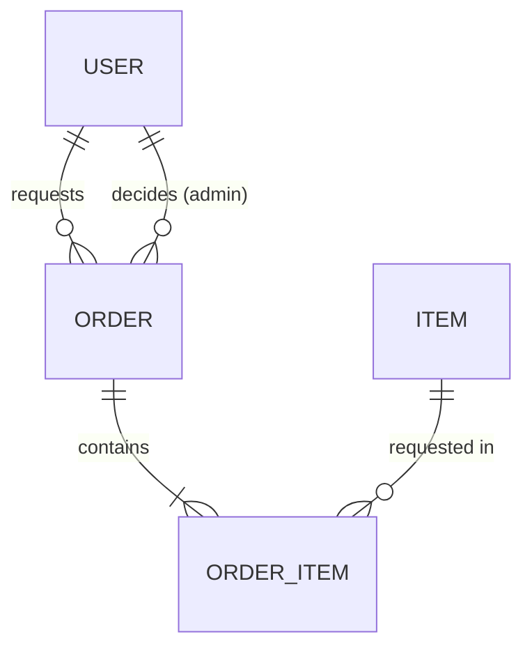
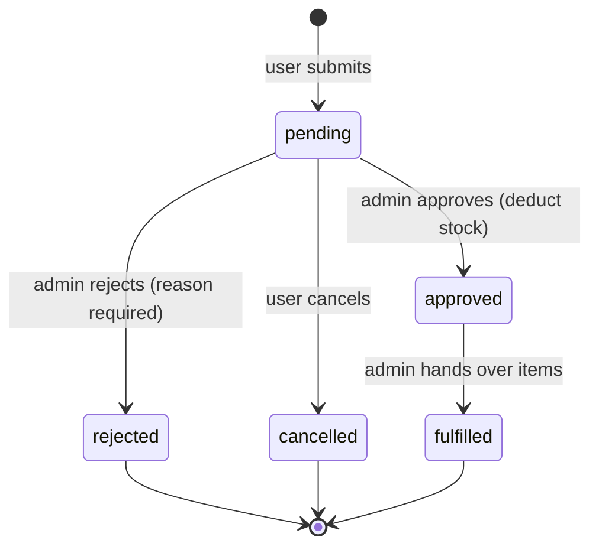

# Inventory Requisition App — Requirements

Users submit requisition requests for items; admins approve, reject, and fulfill them. Email notifications go to both sides.
This English version is the source of truth. `docs/requirements.th.md` is a Thai translation for the team.
Work is split into Phases. Do one Phase per session / per branch.

---

## 1. Roles and Permissions

| Capability | user | admin |
|---|:-:|:-:|
| View items and stock levels | ✅ | ✅ |
| Create a requisition (Order) | ✅ | ✅ |
| View own orders | ✅ | ✅ |
| Cancel own order (only while `pending`) | ✅ | ✅ |
| View all users' orders | ❌ | ✅ |
| Approve / reject / fulfill orders | ❌ | ✅ |
| Create / edit / delete items and adjust stock | ❌ | ✅ |
| Manage users (create, change role, deactivate) | ❌ | ✅ |

- No self sign-up. Admins create accounts.
- A user hitting an admin page is redirected with the message "ไม่มีสิทธิ์เข้าถึง".
- A user cannot access another user's order by guessing the URL (respond 404).

## 2. Tech Stack

| Item | Value |
|---|---|
| Ruby / Rails | 3.3.x / 8.1.4 |
| Database | SQLite3 |
| Authentication | Rails `bin/rails generate authentication` (no Devise) |
| Authorization | Hand-written `before_action` filters (no gems) |
| Email | Action Mailer + `deliver_later` via Solid Queue (Rails 8 default) |
| Frontend | Hotwire (Turbo + Stimulus) via importmap, plain CSS |
| Test / Lint | Minitest / RuboCop (rubocop-rails-omakase) |

## 3. Data Model

Item and Order are many-to-many through `order_items`
(`Item has_many :orders, through: :order_items` and `Order has_many :items, through: :order_items`).

### User
| Field | Type | Rule |
|---|---|---|
| name | string | required |
| email_address | string | required, unique, normalized to lowercase |
| password_digest | string | from `has_secure_password` |
| role | string enum | `user` or `admin`, default `user` |
| active | boolean | default true; deactivated accounts cannot sign in |

### Item
| Field | Type | Rule |
|---|---|---|
| name | string | required |
| sku | string | required, unique, uppercase, format `A-Z0-9-` |
| description | text | optional |
| unit | string | required, e.g. ชิ้น, กล่อง, รีม |
| quantity | integer | required, >= 0, default 0 (stock on hand) |
| low_stock_threshold | integer | required, >= 0, default 5 |
| active | boolean | default true |

- An item that has ever been requested cannot be deleted; admins deactivate it (`active: false`) instead.
- Inactive items are hidden from the order form.

### Order
| Field | Type | Rule |
|---|---|---|
| user_id | references | required (requester) |
| status | string enum | see section 4, default `pending` |
| purpose | text | required (reason for the request) |
| admin_note | text | required when `rejected` |
| decided_by_id | references users | admin who approved/rejected |
| decided_at | datetime | |
| fulfilled_at | datetime | |

- Must contain at least one OrderItem.

### OrderItem
| Field | Type | Rule |
|---|---|---|
| order_id | references | required |
| item_id | references | required |
| quantity | integer | required, > 0 |

- Unique index on `(order_id, item_id)`: an item appears at most once per order.

## 4. Order Status Flow

- Order lines can be edited only while `pending`.
- Any transition not shown in the diagram must be rejected.
- **Stock is deducted on `approved`**: check and deduct every line in a single transaction with row locks on the items. If any line has insufficient stock, the whole order is not approved and the response lists which items are short.

## 5. Email Notifications

| Event | Recipients | Main content |
|---|---|---|
| User creates a new order | All active admins | Requester, purpose, items and quantities, link to the order |
| Order status changes (`approved`, `rejected`, `fulfilled`) | Order owner | New status, reason (if rejected), link to the order |

- Send with `deliver_later`, only after the transaction commits.
- No email when a user cancels their own order.
- Mailer previews in `test/mailers/previews` for every email.
- SMTP settings and sender address come from environment variables (`SMTP_ADDRESS`, `SMTP_PORT`, `SMTP_USERNAME`, `SMTP_PASSWORD`, `MAILER_FROM`). Never hardcode them.
- Development uses mailer previews / logs; no real emails are sent.

---

## 6. Phases and Acceptance Criteria

### Phase 1 — Setup, Authentication, Roles
- [x] Create a Rails 8.1.4 app at the repo root
- [x] Install authentication with the Rails generator and add `name`, `role`, `active` to User
- [x] Every page requires sign-in; `active: false` accounts cannot sign in
- [x] `require_admin` filter and `Current.user.admin?` work
- [x] Admins manage users (list / create / edit role / deactivate) and cannot deactivate themselves
- [x] Seeds: 1 admin from `SEED_ADMIN_EMAIL` / `SEED_ADMIN_PASSWORD` and 2 sample users (password from `SEED_USER_PASSWORD`)
- [x] Tests cover sign-in, admin authorization, and deactivation

### Phase 2 — Items
- [x] Admin: item CRUD and stock adjustment
- [x] User: read-only item list and detail
- [x] Search by name or SKU, filter "low stock"; badge for low-stock items
- [x] Seed 10 sample items
- [x] Tests cover validations, authorization, and search

### Phase 3 — Orders
- [x] Users create an order with multiple lines in one form (add/remove rows with Stimulus, `accepts_nested_attributes_for`)
- [x] Users see only their own orders and can cancel only `pending` ones
- [x] Admins see all orders, filter by status, oldest `pending` first
- [x] Admins approve / reject (reason required) / fulfill following section 4
- [x] Approval deducts stock correctly and is refused when stock is insufficient
- [x] Order page shows status badge and decision/fulfillment timestamps
- [x] Tests cover valid and invalid transitions, stock deduction, insufficient stock, and access control

### Phase 4 — Email Notifications
- [x] `OrderMailer#new_request` goes to all active admins when an order is created
- [x] `OrderMailer#status_changed` goes to the order owner on `approved` / `rejected` / `fulfilled`
- [x] Production SMTP configured from environment variables
- [x] Mailer previews for every email
- [ ] Tests use `assert_enqueued_email_with` for cases that send and `assert_no_enqueued_emails` for cases that must not (e.g. user cancels)

---

## 7. Non-functional

- Basic responsive UI. All UI and email text in Thai.
- `bin/rails test` and `bin/rubocop` must pass before every push.
- No secrets (keys, passwords, tokens) in the repo.

## 8. Out of Scope

- Multiple warehouses/departments, multi-step approval
- Item returns, detailed goods-receipt history
- Item images, file import/export
- Production deployment