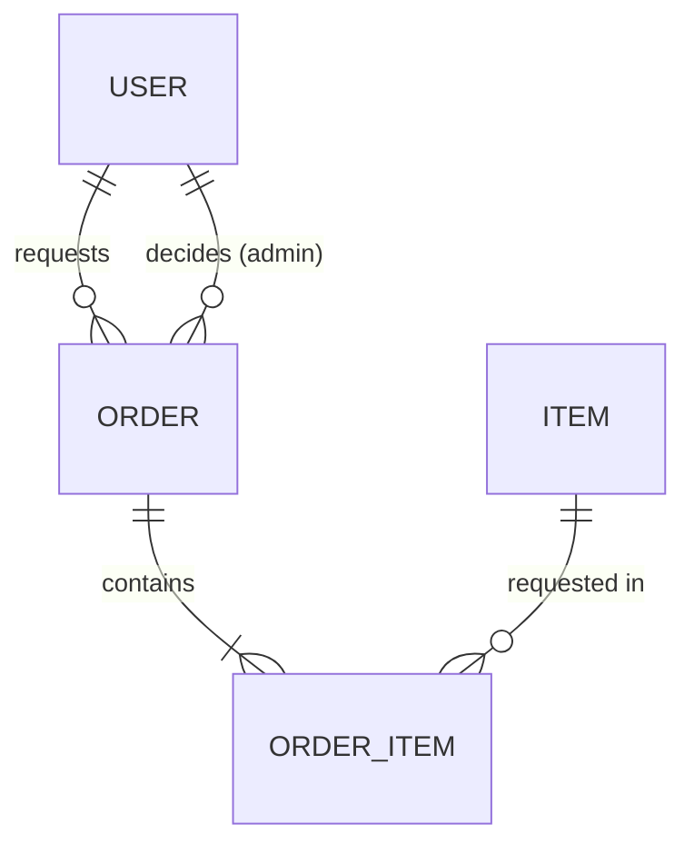
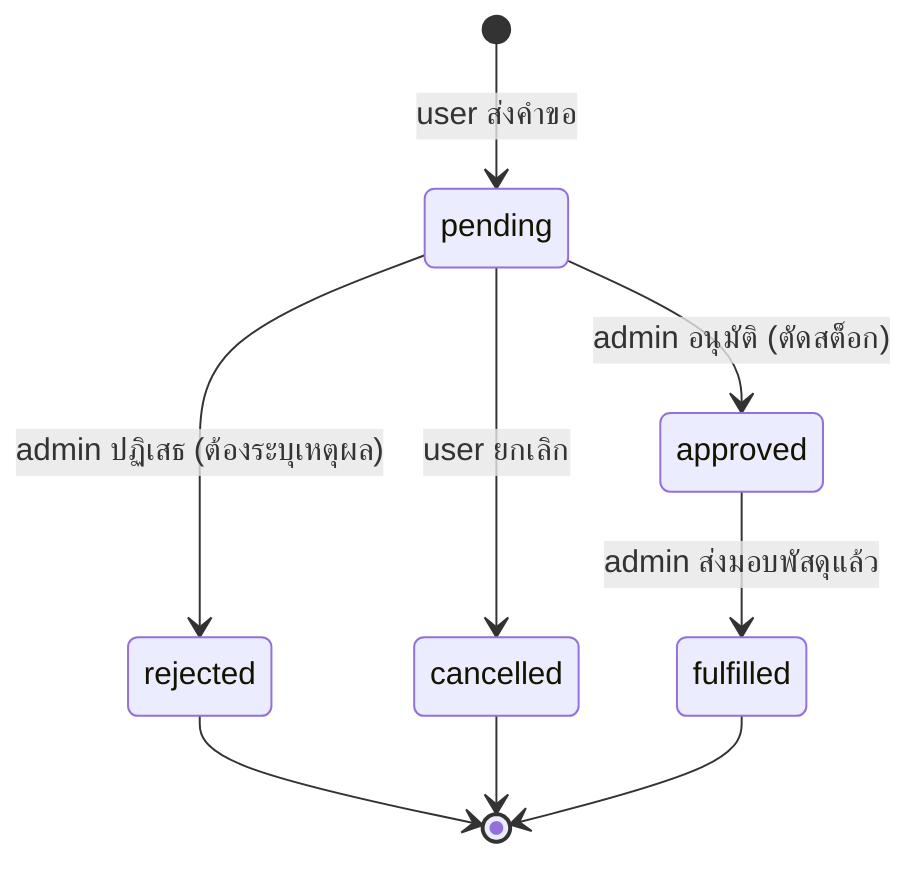

# Inventory Requisition App — Requirements (ฉบับภาษาไทย)

> ฉบับนี้สำหรับทีมอ่านเท่านั้น ฉบับหลักที่ Claude ใช้คือ `docs/requirements.md` (ภาษาอังกฤษ) หากแก้ไข requirement ให้แก้ฉบับภาษาอังกฤษก่อน แล้วอัปเดตฉบับนี้ให้ตรงกัน

ระบบเบิกพัสดุ: ผู้ใช้ (user) สร้างคำขอเบิกพัสดุ ผู้ดูแล (admin) อนุมัติ/ปฏิเสธและส่งมอบ
พร้อมแจ้งเตือนทางอีเมลทั้งสองฝั่ง
งานแบ่งเป็น Phase ให้ทำทีละ Phase ต่อหนึ่ง session / หนึ่ง branch

---

## 1. Roles และสิทธิ์

| ความสามารถ | user | admin |
|---|:-:|:-:|
| ดูรายการพัสดุและจำนวนคงเหลือ | ✅ | ✅ |
| สร้างคำขอเบิก (Order) | ✅ | ✅ |
| ดูคำขอเบิกของตัวเอง | ✅ | ✅ |
| ยกเลิกคำขอของตัวเอง (เฉพาะสถานะ `pending`) | ✅ | ✅ |
| ดูคำขอเบิกของทุกคน | ❌ | ✅ |
| อนุมัติ / ปฏิเสธ / ส่งมอบ คำขอ | ❌ | ✅ |
| เพิ่ม/แก้ไข/ลบ พัสดุ และปรับยอดคงเหลือ | ❌ | ✅ |
| จัดการผู้ใช้ (สร้าง, เปลี่ยน role, ปิดการใช้งาน) | ❌ | ✅ |

- ไม่มีการสมัครสมาชิกเอง admin เป็นผู้สร้างบัญชีให้
- user ที่เข้าหน้าของ admin ต้องถูก redirect พร้อมข้อความ "ไม่มีสิทธิ์เข้าถึง"
- user เข้าถึง order ของคนอื่นด้วยการเดา URL ไม่ได้ (ตอบ 404)

## 2. Tech Stack

| รายการ | ค่าที่ใช้ |
|---|---|
| Ruby / Rails | 3.3.x / 8.1.4 |
| Database | SQLite3 |
| Authentication | `bin/rails generate authentication` ของ Rails (ไม่ใช้ Devise) |
| Authorization | เขียนเองด้วย `before_action` (ไม่ใช้ gem) |
| Email | Action Mailer + `deliver_later` ผ่าน Solid Queue (ค่าเริ่มต้นของ Rails 8) |
| Frontend | Hotwire (Turbo + Stimulus) ผ่าน importmap, CSS ธรรมดา |
| Test / Lint | Minitest / RuboCop (rubocop-rails-omakase) |

## 3. Data Model

Item กับ Order เป็นความสัมพันธ์แบบ many-to-many ผ่านตาราง `order_items`
(`Item has_many :orders, through: :order_items` และ `Order has_many :items, through: :order_items`)

### User
| Field | Type | Rule |
|---|---|---|
| name | string | required |
| email_address | string | required, unique, normalize เป็นตัวพิมพ์เล็ก |
| password_digest | string | จาก `has_secure_password` |
| role | string enum | `user` หรือ `admin`, default `user` |
| active | boolean | default true; บัญชีที่ปิดแล้วล็อกอินไม่ได้ |

### Item (พัสดุ)
| Field | Type | Rule |
|---|---|---|
| name | string | required |
| sku | string | required, unique, ตัวพิมพ์ใหญ่, รูปแบบ `A-Z0-9-` |
| description | text | optional |
| unit | string | required เช่น ชิ้น, กล่อง, รีม |
| quantity | integer | required, >= 0, default 0 (ยอดคงเหลือ) |
| low_stock_threshold | integer | required, >= 0, default 5 |
| active | boolean | default true |

- ลบ Item ที่เคยถูกเบิกแล้วไม่ได้ (ให้ admin ปิดการใช้งานแทนด้วย `active: false`)
- พัสดุที่ปิดการใช้งานจะไม่แสดงในฟอร์มขอเบิก

### Order (คำขอเบิก)
| Field | Type | Rule |
|---|---|---|
| user_id | references | required (ผู้ขอเบิก) |
| status | string enum | ดูข้อ 4, default `pending` |
| purpose | text | required (เหตุผลการเบิก) |
| admin_note | text | required เมื่อ `rejected` |
| decided_by_id | references users | admin ผู้อนุมัติ/ปฏิเสธ |
| decided_at | datetime | |
| fulfilled_at | datetime | |

- ต้องมี OrderItem อย่างน้อย 1 รายการ

### OrderItem
| Field | Type | Rule |
|---|---|---|
| order_id | references | required |
| item_id | references | required |
| quantity | integer | required, > 0 |

- unique index ที่ `(order_id, item_id)` — พัสดุเดียวกันอยู่ใน order เดียวได้ครั้งเดียว

## 4. Order Status Flow

- แก้ไขรายการใน order ได้เฉพาะตอน `pending`
- การเปลี่ยนสถานะที่ไม่อยู่ในแผนภาพต้องถูกปฏิเสธ
- **การตัดสต็อกเกิดตอน `approved`**: ตรวจยอดทุกรายการและหักยอดภายใน transaction เดียวกัน พร้อม lock แถว Item; ถ้ารายการใดไม่พอ ต้องไม่อนุมัติทั้ง order และแจ้งว่ารายการใดขาด

## 5. Email Notifications

| เหตุการณ์ | ผู้รับ | เนื้อหาหลัก |
|---|---|---|
| user สร้าง order ใหม่ | admin ทุกคนที่ active | ผู้ขอ, เหตุผล, รายการพัสดุและจำนวน, ลิงก์ไปหน้า order |
| สถานะ order เปลี่ยน (`approved`, `rejected`, `fulfilled`) | เจ้าของ order | สถานะใหม่, เหตุผล (กรณี rejected), ลิงก์ไปหน้า order |

- ส่งด้วย `deliver_later` หลัง transaction commit แล้วเท่านั้น
- user ยกเลิก order เองไม่ต้องส่งอีเมล
- มี mailer preview ใน `test/mailers/previews` สำหรับทุกอีเมล
- ค่า SMTP และอีเมลผู้ส่งอ่านจาก environment variables (`SMTP_ADDRESS`, `SMTP_PORT`, `SMTP_USERNAME`, `SMTP_PASSWORD`, `MAILER_FROM`) ห้ามเขียนไว้ในโค้ด
- development ใช้ mailer preview / log ไม่ส่งอีเมลจริง

---

## 6. Phase และ Acceptance Criteria

### Phase 1 — Setup, Authentication, Roles
- [ ] สร้างโปรเจกต์ Rails 8.1.4 ที่ root ของ repo
- [ ] ติดตั้ง authentication ด้วย generator ของ Rails และเพิ่ม `name`, `role`, `active` ให้ User
- [ ] ทุกหน้าต้องล็อกอิน; บัญชี `active: false` ล็อกอินไม่ได้
- [ ] helper `require_admin` และ `Current.user.admin?` ใช้งานได้
- [ ] admin จัดการผู้ใช้ได้ (list / create / edit role / deactivate) และปิดบัญชีตัวเองไม่ได้
- [ ] seed: admin 1 คนจาก `SEED_ADMIN_EMAIL` / `SEED_ADMIN_PASSWORD` และ user ตัวอย่าง 2 คน (รหัสผ่านจาก `SEED_USER_PASSWORD`)
- [ ] test ครอบคลุมการล็อกอิน, การกันสิทธิ์ admin และการปิดบัญชี

### Phase 2 — พัสดุ (Items)
- [ ] admin: CRUD พัสดุ และปรับยอดคงเหลือ
- [ ] user: ดูรายการและรายละเอียดพัสดุแบบอ่านอย่างเดียว
- [ ] ค้นหาจากชื่อหรือ SKU, กรองเฉพาะ "ใกล้หมด"; badge สำหรับพัสดุใกล้หมด
- [ ] seed พัสดุตัวอย่าง 10 รายการ
- [ ] test ครอบคลุม validation, สิทธิ์ และการค้นหา

### Phase 3 — คำขอเบิก (Orders)
- [ ] user สร้าง order พร้อมหลายรายการในฟอร์มเดียว (เพิ่ม/ลบแถวด้วย Stimulus, `accepts_nested_attributes_for`)
- [ ] user เห็นเฉพาะ order ของตัวเอง และยกเลิกได้เฉพาะ `pending`
- [ ] admin เห็นทุก order กรองตามสถานะได้ เรียง `pending` เก่าสุดก่อน
- [ ] admin อนุมัติ / ปฏิเสธ (บังคับเหตุผล) / ส่งมอบ ตาม flow ข้อ 4
- [ ] อนุมัติแล้วตัดสต็อกถูกต้อง และไม่อนุมัติเมื่อสต็อกไม่พอ
- [ ] หน้า order แสดงสถานะเป็น badge และประวัติเวลาตัดสินใจ/ส่งมอบ
- [ ] test ครอบคลุม status transition ที่ถูกและผิด, การตัดสต็อก, สต็อกไม่พอ และสิทธิ์การเข้าถึง

### Phase 4 — Email Notifications
- [ ] `OrderMailer#new_request` ส่งถึง admin ที่ active ทุกคนเมื่อมี order ใหม่
- [ ] `OrderMailer#status_changed` ส่งถึงเจ้าของ order เมื่อ `approved` / `rejected` / `fulfilled`
- [ ] ตั้งค่า SMTP ใน production จาก environment variables
- [ ] mailer preview ครบทุกอีเมล
- [ ] test ด้วย `assert_enqueued_email_with` ทั้งกรณีที่ต้องส่งและไม่ต้องส่ง (เช่น user ยกเลิก)

---

## 7. Non-functional

- UI responsive พื้นฐาน, ข้อความบนหน้าจอและอีเมลเป็นภาษาไทย
- `bin/rails test` และ `bin/rubocop` ต้องผ่านก่อน push ทุกครั้ง
- ไม่มีข้อมูลลับ (secrets, keys, passwords) อยู่ใน repo

## 8. Out of Scope

- หลายคลัง/หลายแผนก, การอนุมัติหลายขั้น
- การคืนพัสดุ, ประวัติการรับเข้าแบบละเอียด
- รูปภาพพัสดุ, การนำเข้า/ส่งออกไฟล์
- Deploy ขึ้น production